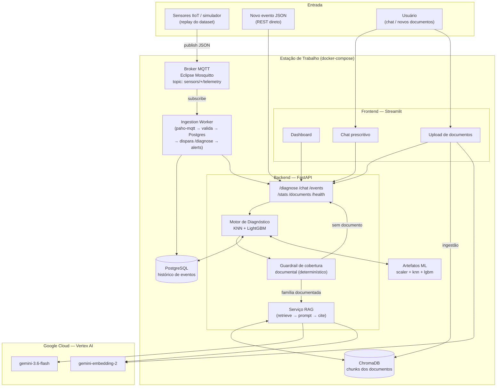
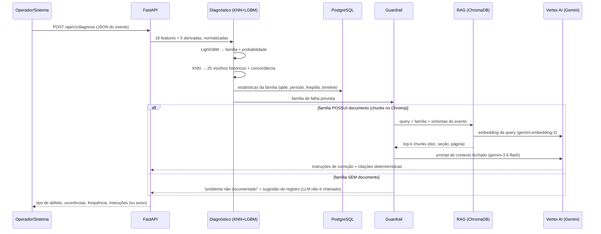
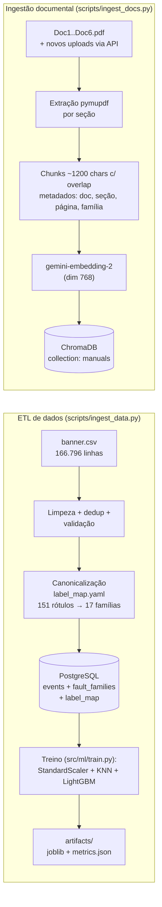
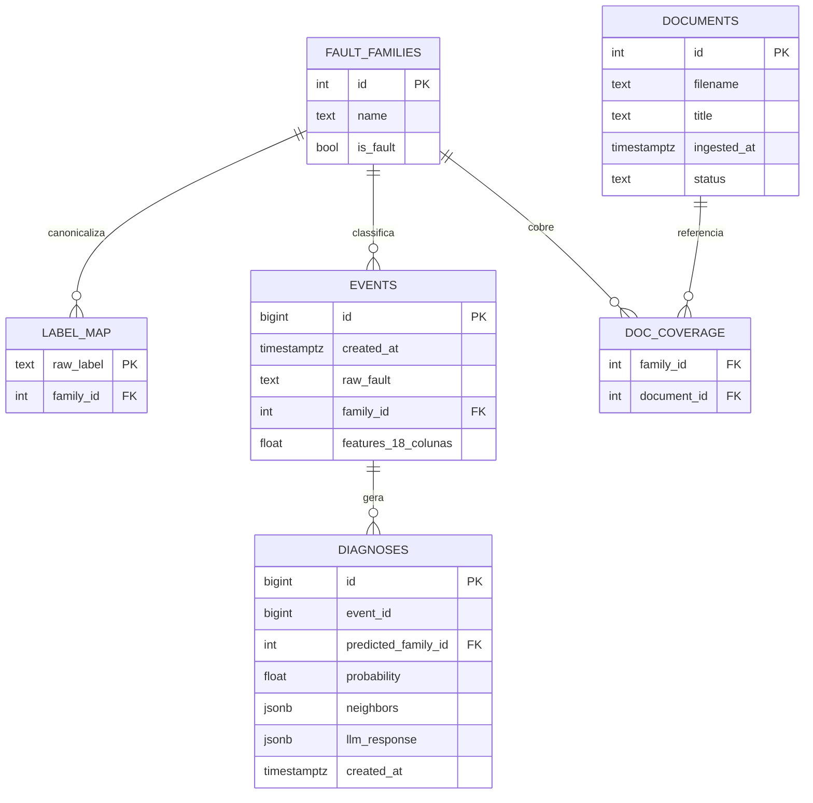
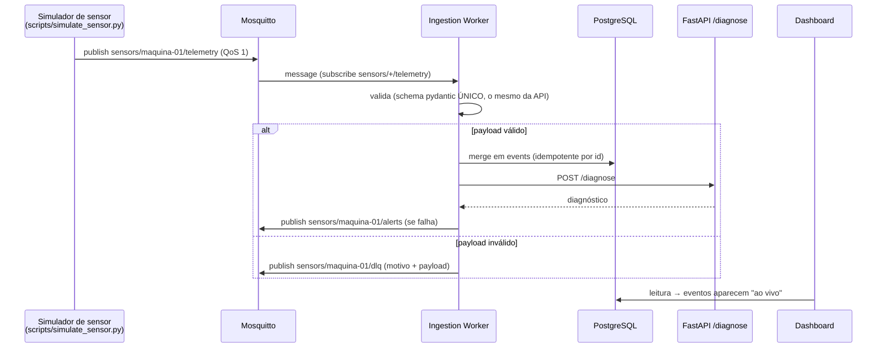
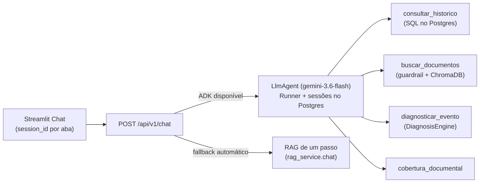
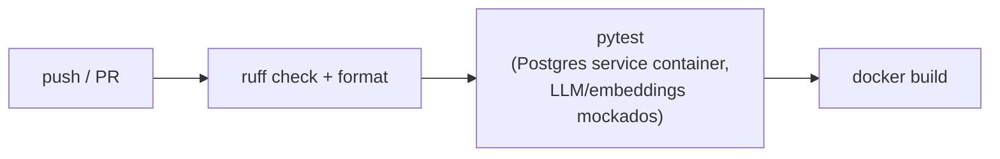

# Arquitetura — Solução de Manutenção Prescritiva

> Prova SENAI SC — Dev Full Stack I.A. e Python. Dado um novo evento JSON de sensores de vibração, o sistema identifica o tipo de defeito, quantifica ocorrências históricas similares (quantidade, distribuição temporal, frequência) e gera **instruções de correção** via RAG sobre a base documental da empresa — restringindo-se **apenas a falhas documentadas**; caso contrário, informa que o problema ainda não está documentado e sugere o registro de um novo documento.

## 1. Visão geral



## 2. Decisões arquiteturais (ADRs)

| # | Decisão | Justificativa | Alternativa rejeitada |
|---|---------|---------------|----------------------|
| ADR-01 | **ChromaDB** (persistente, local) como vector store | Embarcado, filtros por metadados, roda na estação alvo (32 GB RAM / GPU 16 GB) | FAISS (sem metadados nativos), pgvector (acopla RAG ao Postgres) |
| ADR-02 | **`gemini-embedding-2`** (Vertex AI) para embeddings | Modelo mais recente do Google (GA abr/2026): multilíngue, contexto 8.192 tokens, dimensões Matryoshka (usamos 768), multimodal (evolução p/ diagramas dos manuais) | `gemini-embedding-001`, sentence-transformers local |
| ADR-03 | **`gemini-3.6-flash`** (Vertex AI) para geração, `temperature=0.2`, ID parametrizado via `.env` | Flash mais recente (jul/2026), contexto 1M, custo/latência baixos | Modelo local (qualidade PT-BR inferior no hardware alvo) |
| ADR-04 | Diagnóstico = **KNN + LightGBM** | KNN responde "ocorrências similares" literalmente; LightGBM dá o tipo de defeito com probabilidade; a concordância entre ambos vira métrica de confiança | Só KNN (sem probabilidade); rede neural (overkill p/ tabular) |
| ADR-05 | **Canonicalização de rótulos** via regras regex ordenadas em YAML | 151 rótulos brutos ruidosos (typos reais: `ddesbalanceado`, `cockecocked`, `mortor_desligado`) → 17 famílias; auditável, rótulo desconhecido = erro explícito | Clustering automático (não auditável) |
| ADR-06 | **FastAPI** como camada de serviço; Streamlit só consome a API | API reutilizável p/ integração industrial (SCADA/CMMS/historian) | Streamlit monolito |
| ADR-07 | **PostgreSQL** (Docker) simulando o banco corporativo | ETL real do CSV; agregações do dashboard em SQL | DuckDB/SQLite |
| ADR-08 | **docker-compose** (postgres + mosquitto + api + worker + ui) | Reprodutível na estação alvo | K8s (excesso p/ o escopo) |
| ADR-09 | Guardrail de cobertura documental **determinístico** — família documentada ⇔ possui chunks no Chroma | Requisito duro do edital; o LLM **nunca** decide se existe documento | Deixar o LLM decidir (risco de alucinação) |
| ADR-10 | Ingestão de eventos via **MQTT** (Mosquitto + worker paho-mqtt + simulador) | Protocolo de fato do chão de fábrica; ciclo completo sensor → diagnóstico → alerta de volta à planta | Só REST; OPC UA (setup pesado — citado como evolução) |
| ADR-11 | **Agente Google ADK apenas no /chat** (LlmAgent + 4 ferramentas + sessões no Postgres); o /diagnose permanece determinístico | Agente agrega valor onde há decisão dinâmica de ferramenta (perguntas exploratórias sobre histórico/documentos); no caminho crítico, um loop agêntico enfraqueceria as garantias anti-alucinação e a previsibilidade exigida pela prova | Agentificar todo o pipeline (imprevisível, caro no fluxo MQTT); function calling manual (perderia sessões/orquestração prontas do ADK) |

## 3. Fluxo do novo evento



## 4. Pipeline de dados e documentos



**Cobertura documental inicial** (`src/rag/coverage.yaml`): rolamentos (4 famílias) → Doc1; desalinhamento → Doc2; desbalanceamento → Doc3; correia → Doc4; polia → Doc5; cocked_rotor → Doc6. Famílias **sem documento** — `eccentric_rotor`, `ventoinha`, `falta_fase` — acionam o fluxo "problema não documentado → sugerir registro" exigido pelo edital. Em runtime a cobertura é dinâmica: um documento cadastrado via `POST /documents` passa a cobrir a família imediatamente.

## 5. Modelo de dados (PostgreSQL)



## 6. Motor de diagnóstico (ML)

- **Features**: 18 colunas brutas (unidades SI; duplicatas in/s e °F descartadas por colinearidade) + 5 derivadas fisicamente motivadas (`src/ml/features.py`): ordem do pico (freq/freq_rotação — as assinaturas dos manuais são em 1x/2x RPM, não em Hz absoluto), razão radial/axial e razão HF/LF (defeitos de rolamento excitam alta frequência).
- **KNN** (25 vizinhos, distância euclidiana em espaço padronizado) indexa **todo** o histórico — responde diretamente ao requisito de "registros históricos com comportamento semelhante".
- **LightGBM** multiclasse (17 famílias, `class_weight=balanced`) fornece o tipo de defeito com probabilidade.
- **Confiança** = probabilidade × concordância dos vizinhos → `alta` / `media` / `baixa` (exibida na UI).

### Validação — honestidade metodológica

O dataset é composto por **sessões de coleta** (o rótulo bruto identifica a sessão). Leituras da mesma sessão são quase idênticas, o que invalida o split aleatório como métrica de generalização; e um split temporal puro é impossível (4 famílias só existem no período final). Reportamos as duas avaliações (`artifacts/metrics.json`):

| Avaliação | O que mede | Accuracy | F1 macro |
|---|---|---|---|
| **Holdout por sessão** (principal) | Generalizar p/ **novas campanhas** de coleta | ~0,14 | ~0,20 |
| Split aleatório estratificado (referência) | Separabilidade dos padrões dentro das sessões | ~0,89 | ~0,86 |

**Causa-raiz diagnosticada** (análise completa em [ANALYTICS.md](ANALYTICS.md) §4): o gap não é ruído de amostragem, é **confundimento entre sessão e rótulo**. Decompondo a variância de cada feature entre e dentro das campanhas de coleta, **16 das 18 features** dispersam mais entre campanhas do que dentro delas — a temperatura lidera com 8,8× (2,70 °C entre campanhas vs 0,31 °C dentro). Como cada condição foi coletada numa única campanha, o modelo pode acertar o rótulo pelo "carimbo" da campanha.

Um teste de ablação removendo a temperatura (registrado como `eval_session_holdout_no_temp`) **piorou** o F1 (0,195 → 0,165): o vazamento é sistêmico, não de uma feature — retirar a mais extrema só faz o modelo migrar para a próxima proxy. A correção é de coleta (múltiplas campanhas por condição), não de modelagem.

Mitigações no design atual: (1) o KNN compara contra o **histórico completo** e responde "ocorrências similares" em vez de afirmar uma classe — é a saída mais defensável sob esse teto e é literalmente o que o edital pede; (2) o gate de confiança (probabilidade × concordância dos vizinhos) sinaliza diagnóstico incerto em vez de afirmar com falsa segurança; (3) o dashboard expõe as três avaliações e a evidência do vazamento, em vez de anunciar os 89% do split aleatório.

## 7. Integração industrial — MQTT



- **QoS 1** (*at-least-once*) + `session.merge` idempotente por `id` → nenhum evento perdido nem duplicado.
- **DLQ**: payload inválido nunca é descartado em silêncio.
- **Alertas**: o diagnóstico volta à planta por MQTT — é assim que um SCADA/CMMS consumiria a solução.
- Evolução p/ produção: TLS + autenticação no broker, OPC UA para CLPs, payloads Sparkplug B.

## 8. Anti-alucinação (critério explícito da prova)

1. **Guardrail determinístico**: o LLM só é chamado se a família tem chunks indexados no Chroma — cobertura nunca é decidida pelo modelo.
2. **Contexto fechado**: system prompt exige responder somente com base nos trechos fornecidos, com marcadores `[n]`.
3. **Citações determinísticas**: doc/seção/página vêm dos **metadados do retrieval**, não do texto do LLM — citação alucinada é estruturalmente impossível.
4. `temperature=0.2`.
5. **Confiança dupla** (LightGBM × KNN) exibida na UI; abaixo do limiar → "diagnóstico incerto".

## 9. Agente de chat — Google ADK

O `/chat` é atendido por um agente **Google ADK** (`LlmAgent` sobre `gemini-3.6-flash`) com memória de conversa persistida no Postgres (`DatabaseSessionService`, em **schema dedicado `adk`** — a tabela `events` do ADK colidiria com a do domínio) e 4 ferramentas que reutilizam os módulos existentes:



Propriedades importantes:
- **Guardrail dentro da ferramenta**: `buscar_documentos` verifica a cobertura documental ANTES do retrieval; família sem documento retorna `documentado=false` + aviso estruturado — o LLM transmite, nunca decide.
- **Citações determinísticas**: um coletor (`contextvars`) registra doc/seção/página dos chunks realmente recuperados; a UI exibe essas fontes, não texto gerado.
- **Fallback automático**: sem `google-adk`/credenciais GCP, `get_agent()` retorna `None` e o endpoint cai no RAG de um passo — o chat nunca fica indisponível (badge na UI indica o modo).
- **Fronteira arquitetural (ADR-11)**: o agente existe só onde há decisão dinâmica de ferramenta; `POST /diagnose` (usado pelo worker MQTT) permanece 100% determinístico.

## 10. Estrutura do repositório

```
FIESC/
├── ARCHITECTURE.md            # este documento
├── README.md                  # setup e uso
├── docker-compose.yml         # postgres + mosquitto + api + worker + ui
├── Dockerfile                 # imagem única (api/worker/ui via command)
├── .env.example
├── .github/workflows/ci.yml   # ruff → pytest (LLM mockado) → docker build
├── pyproject.toml
├── src/
│   ├── core/                  # config, schemas pydantic (únicos), modelos SQLAlchemy
│   ├── etl/                   # label_map.yaml + canonicalização auditável
│   ├── ml/                    # features físicas, treino, diagnóstico (KNN+LGBM)
│   ├── rag/                   # chunking, ChromaDB, guardrail, orquestração RAG
│   ├── llm/                   # cliente Vertex AI, prompts, agente ADK + ferramentas
│   ├── api/                   # FastAPI
│   ├── ingestion/             # worker MQTT (DLQ, alerts)
│   └── ui/                    # Streamlit
├── scripts/                   # ingest_data, ingest_docs, simulate_sensor
├── artifacts/                 # modelos treinados (gerados, fora do git)
└── tests/                     # 46 testes (unit + integração, 100% offline)
```

## 11. CI/CD (GitHub Actions)



Credenciais (`GOOGLE_APPLICATION_CREDENTIALS`) só via GitHub Secrets / `.env` local. Os testes de CI **não** chamam o Vertex AI: o `FakeLLM` implementa a mesma interface do cliente real (embeddings determinísticos por hash + geração canned), injetado via `dependency_overrides` do FastAPI.

## 12. Restrição de hardware do edital

A estação alvo (32 GB RAM, GPU 16 GB) executa com folga: os artefatos ML somam < 100 MB (LightGBM + índice KNN), o ChromaDB local tem centenas de chunks, e os modelos pesados (LLM/embeddings) rodam como serviço gerenciado no Vertex AI — nenhuma inferência local de LLM é necessária.
